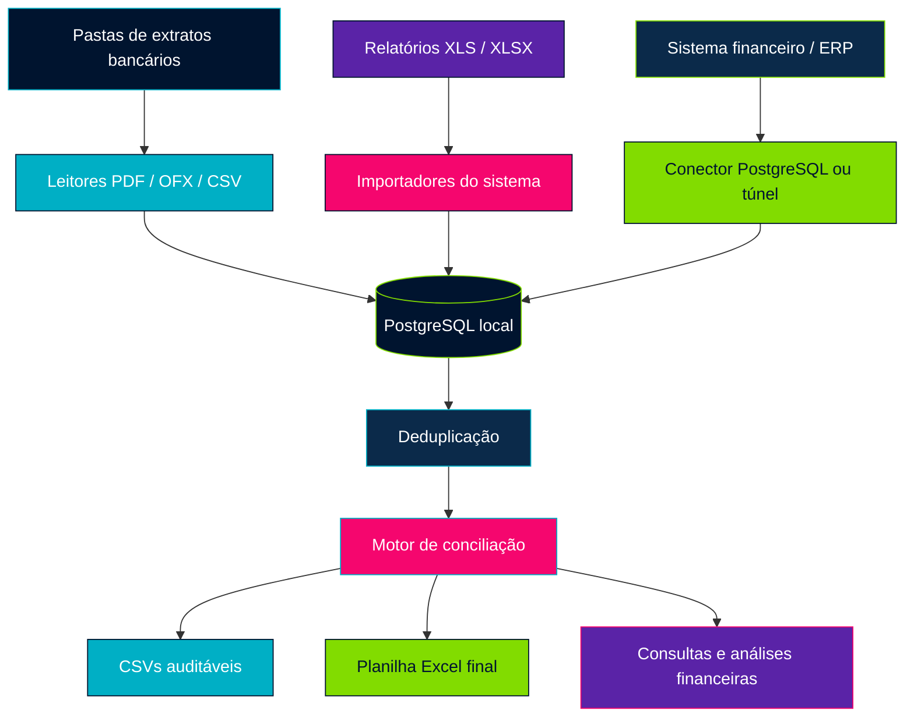
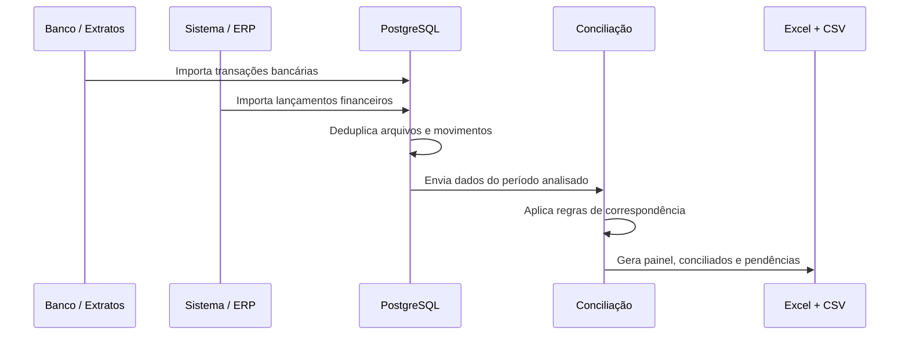

<div align="center">


# BankSync — Conciliação Bancária Automatizada

**Automação financeira para importar extratos, integrar dados do sistema, conciliar lançamentos e transformar movimentações bancárias em uma base histórica auditável.**

[](#-status-do-projeto)
[](https://www.python.org)
[](https://www.postgresql.org)
[](#-leitores-banc%C3%A1rios)
[](#-relat%C3%B3rios-gerados)
[](./LICENSE)

**Projeto funcional em validação operacional**

</div>

---

> [!NOTE]
> Este repositório não contém extratos reais, planilhas financeiras, credenciais, caminhos internos ou dados de produção. Os arquivos sensíveis ficam apenas no ambiente local.

## Sumário

- [Objetivo do projeto](#-objetivo-do-projeto)
- [O que o BankSync faz](#-o-que-o-banksync-faz)
- [Arquitetura](#%EF%B8%8F-arquitetura)
- [Fluxo operacional](#-fluxo-operacional)
- [Regras de conciliação](#-regras-de-concilia%C3%A7%C3%A3o)
- [Leitores bancários](#-leitores-banc%C3%A1rios)
- [Integração com sistema financeiro](#-integra%C3%A7%C3%A3o-com-sistema-financeiro)
- [Tecnologias utilizadas](#%EF%B8%8F-tecnologias-utilizadas)
- [Relatórios gerados](#-relat%C3%B3rios-gerados)
- [Como executar localmente](#-como-executar-localmente)
- [Estrutura do repositório](#-estrutura-do-reposit%C3%B3rio)
- [Decisões técnicas e cuidados](#-decis%C3%B5es-t%C3%A9cnicas-e-cuidados)
- [Segurança e privacidade](#-seguran%C3%A7a-e-privacidade)
- [Roadmap](#-roadmap)
- [Status do projeto](#-status-do-projeto)
- [Autor](#-autor)
- [Licença](#-licen%C3%A7a)

---

## 🎯 Objetivo do projeto

O **BankSync** resolve uma dor comum em rotinas financeiras: conciliar manualmente extratos bancários e lançamentos do sistema, linha por linha, tentando descobrir se cada pagamento, recebimento, imposto, transferência ou baixa realmente aparece dos dois lados.

Em vez de depender de conferência manual em PDFs, planilhas e relatórios separados, o BankSync cria uma base histórica local em PostgreSQL, importa movimentações de múltiplas fontes, aplica regras de deduplicação e gera relatórios de conciliação prontos para análise.

| Dor operacional | Como o BankSync ajuda |
|---|---|
| Muitos extratos em PDF | Extrai transações e transforma em dados estruturados |
| Relatórios do sistema difíceis de cruzar | Padroniza lançamentos para comparação com o banco |
| Lançamentos parcelados | Busca combinações em que várias parcelas fecham o valor total |
| Datas divergentes | Concilia quando há evidência e sinaliza a diferença |
| Descrições diferentes | Usa documento, valor, fornecedor e texto aproximado |
| Duplicidade de arquivos | Deduplica por hash, conta, data, valor e descrição |
| Histórico espalhado | Mantém uma base permanente consultável |

---

## ⚙️ O que o BankSync faz

| Área | Função |
|---|---|
| Extração bancária | Lê extratos em PDF, OFX e CSV |
| Importação do sistema | Importa XLS/XLSX ou consulta o banco do sistema quando disponível |
| Base histórica | Armazena transações bancárias, lançamentos do sistema e arquivos processados |
| Deduplicação | Evita reprocessar arquivos ou duplicar movimentos sobrepostos |
| Conciliação | Cruza banco e sistema por valor, data, CNPJ/CPF, documento, fornecedor e descrição |
| Parcelamento | Localiza grupos de parcelas que somam exatamente o valor correspondente |
| Tributos | Associa pagamentos à Caixa Econômica com impostos e encargos quando há evidência |
| Relatórios | Gera CSVs e planilhas Excel com painel, pendências, divergências e duplicidades |
| Auditoria | Preserva origem, hash, período e metadados dos arquivos importados |

---

## 🏗️ Arquitetura



---

## 🔄 Fluxo operacional



| Etapa | Resultado esperado |
|---|---|
| 1. Coleta | Arquivos novos são localizados nas pastas configuradas |
| 2. Extração | PDFs e OFXs viram transações estruturadas |
| 3. Importação | Dados entram no PostgreSQL com rastreabilidade |
| 4. Deduplicação | Movimentos repetidos são evitados |
| 5. Conciliação | Banco e sistema são comparados em camadas |
| 6. Revisão | Divergências e validações humanas ficam sinalizadas |

---

## 🧩 Regras de conciliação

### Conciliado

Usado quando há evidência forte de que banco e sistema representam a mesma operação.

Exemplos:

- mesmo CNPJ, valor e data;
- mesmo CNPJ, valor e data próxima;
- mesmo valor, fornecedor compatível e data próxima;
- soma exata de parcelas com documento, fornecedor ou tributo compatível.

### Valor igual validar

Usado quando o valor bate, mas alguma informação precisa de conferência.

Exemplos:

- data diferente;
- documento ausente;
- CNPJ divergente;
- fornecedor diferente;
- descrição sem relação textual forte;
- múltiplos lançamentos iguais no mesmo mês.

> [!IMPORTANT]
> Essa classificação é intencional. O BankSync pode conciliar automaticamente pelo valor, mas deixa a linha sinalizada para validação humana.

### Banco sem sistema

Transação encontrada no banco sem correspondência suficiente no sistema.

Pode indicar:

- lançamento ainda não registrado;
- valor lançado de forma diferente;
- documento ausente;
- baixa feita em outra conta;
- transferência ainda não classificada.

### Sistema sem banco

Lançamento existente no sistema sem transação bancária correspondente.

Pode indicar:

- lançamento provisionado, mas ainda não realizado;
- baixa em outra data;
- baixa em outra conta;
- lançamento duplicado no sistema;
- relatório do sistema mais detalhado que o extrato.

### Divergências

Usado quando existe indício de relação, mas o valor, a data, o documento ou outra informação relevante não fecha completamente.

### Duplicidades

Sinaliza grupos aparentemente repetidos usando origem, mês, tipo, valor, documento e texto-base.

---

## 🏦 Leitores bancários

O BankSync possui leitores para múltiplos layouts de extratos.

| Banco / Fonte | Situação |
|---|---|
| Cora | Layout tratado |
| Bradesco | Layout tratado |
| Banco do Brasil | Layout tratado |
| Caixa Econômica Federal | Layout tratado |
| Itaú | Layout tratado, com fallback para OCR em alguns PDFs |
| Banco do Nordeste | Layout tratado |
| Unicred | Layout tratado |
| Uniprime | Layout tratado |
| Sicoob | Layout tratado |
| Safra | Layout tratado |
| Stone | Layout tratado |
| Banco da Amazônia / BASA | Layout tratado |

Alguns PDFs podem exigir OCR ou novos leitores quando o banco altera o layout.

---

## 🔗 Integração com sistema financeiro

O BankSync trabalha com duas abordagens:

| Modo | Uso |
|---|---|
| Exportação manual | Importa relatórios XLS/XLSX baixados do sistema |
| Conexão direta | Consulta o banco do sistema quando houver credenciais e acesso autorizados |

Origens gravadas na base:

| Origem | Significado |
|---|---|
| `CLINUX` | Lançamentos financeiros reais do sistema |
| `CLINUX_TRANSFERENCIA` | Transferências entre contas |
| `ERP` | Importações antigas ou manuais |

> [!TIP]
> Transferências são mantidas para conciliação bancária, mas não devem ser misturadas com faturamento bruto.

---

## 🛠️ Tecnologias utilizadas

| Tecnologia | Função |
|---|---|
| Python | Extração, importação, conciliação e automação |
| PostgreSQL | Base histórica local |
| pandas | Leitura e tratamento de planilhas |
| openpyxl | Geração da planilha final em Excel |
| pdfplumber | Extração de texto dos PDFs bancários |
| Tesseract OCR | Apoio a PDFs escaneados |
| OFX parser | Importação de extratos OFX |
| python-dotenv | Configuração local por `.env` |
| Git / GitHub | Versionamento do projeto |

---

## 📊 Relatórios gerados

Os relatórios operacionais são gerados localmente e não são versionados no GitHub.

```text
C:\ConciliaFinanceira\conciliados
```

Arquivos principais:

| Arquivo | Conteúdo |
|---|---|
| `relatorio_conciliacao_ultimos_12_meses.xlsx` | Planilha final para análise |
| `01_resumo.csv` | Indicadores gerais |
| `02_conciliados.csv` | Matches encontrados |
| `03_valor_igual_validar.csv` | Matches por valor igual com validação necessária |
| `04_divergencias.csv` | Divergências formais |
| `05_banco_sem_sistema.csv` | Transações bancárias sem correspondência |
| `06_sistema_sem_banco.csv` | Lançamentos do sistema sem banco |
| `07_duplicidades.csv` | Possíveis duplicidades |
| `08_possiveis_divergencias_valor.csv` | Indícios de relação com diferença de valor |

---

## 💻 Como executar localmente

### Pré-requisitos

- Python 3.12+
- PostgreSQL
- Git
- Tesseract OCR, opcional para PDFs escaneados
- Acesso local aos extratos e relatórios do sistema

### Instalação

```powershell
git clone https://github.com/brunocantt-byte/BankSync-.git
cd BankSync-
python -m venv .venv
.\.venv\Scripts\python.exe -m pip install -r requirements.txt
```

Crie os arquivos locais a partir dos modelos:

```powershell
copy .env.example .env
copy config_pastas.example.json config_pastas.json
```

> [!WARNING]
> `.env` e `config_pastas.json` são arquivos locais. Eles não devem ser enviados ao GitHub.

### Criar estrutura do banco

```powershell
C:\ConciliaFinanceira\.venv\Scripts\python.exe C:\ConciliaFinanceira\python\aplicar_migracao_historico.py
```

### Atualizar a base

```powershell
C:\ConciliaFinanceira\.venv\Scripts\python.exe C:\ConciliaFinanceira\python\atualizar_base.py
```

Ou pelo atalho:

```powershell
C:\ConciliaFinanceira\atualizar_base.bat
```

### Atualizar apenas arquivos

```powershell
C:\ConciliaFinanceira\.venv\Scripts\python.exe C:\ConciliaFinanceira\python\atualizar_base.py --sem-clinux
```

### Atualizar apenas o sistema

```powershell
C:\ConciliaFinanceira\.venv\Scripts\python.exe C:\ConciliaFinanceira\python\atualizar_base.py --somente-clinux
```

### Importar arquivo específico

```powershell
C:\ConciliaFinanceira\.venv\Scripts\python.exe C:\ConciliaFinanceira\python\importar_historico.py --banco C:\CAMINHO\BANCO.pdf --sistema C:\CAMINHO\SISTEMA.xls
```

### Gerar conciliação dos últimos 12 meses

```powershell
C:\ConciliaFinanceira\.venv\Scripts\python.exe -u C:\ConciliaFinanceira\python\conciliar_ultimos_12_meses.py
```

### Gerar planilha final

```powershell
C:\ConciliaFinanceira\.venv\Scripts\python.exe C:\ConciliaFinanceira\python\criar_excel_conciliacao_geral_streaming.py
```

---

## 📁 Estrutura do repositório

```text
BankSync-/
│
├── assets/
│   └── banner.png
│
├── python/
│   ├── atualizar_base.py
│   ├── base_historica.py
│   ├── leitores_pdf_banco.py
│   ├── importar_historico.py
│   ├── importar_clinux_sistema.py
│   ├── conciliar_cora.py
│   ├── conciliar_periodo.py
│   └── conciliar_ultimos_12_meses.py
│
├── sql/
│   ├── schema.sql
│   └── historico_permanente.sql
│
├── README_BASE_HISTORICA.md
├── README_INTEGRACAO_SISTEMA.md
├── README_TUNEL_CLINUX.md
├── config_pastas.example.json
├── atualizar_base.bat
├── requirements.txt
├── LICENSE
└── README.md
```

Pastas locais ignoradas pelo Git:

```text
dados/
entrada/
processados/
conciliados/
erros/
segredos/
.venv/
```

---

## 🧠 Decisões técnicas e cuidados

> [!IMPORTANT]
> Conciliação financeira não deve depender de uma única regra isolada.

- **Valor não basta sozinho**: valores iguais são conciliados com sinalização quando datas, documentos ou fornecedores divergem.
- **Descrição não é fonte absoluta**: bancos costumam abreviar, cortar ou alterar históricos; por isso o motor prioriza valor, documento, CNPJ/CPF, data e fornecedor.
- **Parcelas são consideradas**: o sistema busca grupos de lançamentos cuja soma fecha exatamente com o outro lado.
- **Transferências são preservadas**: elas precisam aparecer na conciliação, mas não entram no cálculo de faturamento bruto.
- **Deduplicação vem antes da análise**: arquivos repetidos ou extratos sobrepostos não devem inflar totais.
- **Auditoria é parte do fluxo**: cada importação mantém origem, hash, período e metadados do arquivo.
- **Dados reais ficam fora do GitHub**: o repositório versiona código e documentação, não informações financeiras.

---

## 🔐 Segurança e privacidade

Este projeto manipula informações financeiras sensíveis. Por isso, o `.gitignore` protege arquivos e pastas locais.

Nunca versionar:

- `.env`;
- `config_pastas.json` com caminhos internos reais;
- extratos bancários;
- relatórios do sistema;
- planilhas finais;
- CSVs extraídos;
- backups;
- credenciais;
- chaves SSH;
- dados de produção.

Trecho essencial do `.gitignore`:

```gitignore
.venv/
.env
config_pastas.json
dados/
processados/
conciliados/
erros/
segredos/
entrada/
*.pdf
*.ofx
*.xls
*.xlsx
*.csv
```

---

## 🚀 Roadmap

| Prioridade | Evolução |
|---|---|
| Alta | Separar comandos de produção e comandos de auditoria |
| Alta | Criar uma CLI única `banksync` |
| Alta | Criar testes automatizados para leitores bancários |
| Média | Melhorar OCR para PDFs escaneados |
| Média | Criar novos leitores para layouts bancários ainda não suportados |
| Média | Criar dashboard web local para consulta rápida |
| Média | Criar agendamento diário de atualização |
| Baixa | Exportar métricas por unidade, banco, conta e centro de custo |
| Baixa | Empacotar instalação para uso em outras máquinas |

---

## ✅ Status do projeto

<div align="center">

**Projeto funcional em validação operacional**

</div>

O BankSync já possui:

| Item | Status |
|---|---|
| Base PostgreSQL local | Pronto |
| Importação de PDF/OFX/CSV | Pronto |
| Importação XLS/XLSX | Pronto |
| Integração com sistema financeiro | Em validação |
| Deduplicação bancária | Pronto |
| Conciliação por regras | Pronto |
| Relatório Excel final | Pronto |
| Dashboard web | Planejado |
| Agendamento automático | Planejado |

---

## 📚 Documentação complementar

| Arquivo | Assunto |
|---|---|
| `README_BASE_HISTORICA.md` | Base permanente, pastas, atualização e leitores |
| `README_INTEGRACAO_SISTEMA.md` | Como pedir acesso ao banco do sistema |
| `README_TUNEL_CLINUX.md` | Túnel próprio para sistema financeiro |

---

## 📜 Licença

Distribuído sob a licença MIT. Veja [LICENSE](./LICENSE) para mais detalhes.

---

<div align="center">

## 👨‍💻 Autor

**Bruno Cantanhede**

[](https://github.com/brunocantt-byte)

Projeto desenvolvido como parte de uma iniciativa prática de automação financeira, dados, conciliação bancária e integração de sistemas.

</div>
