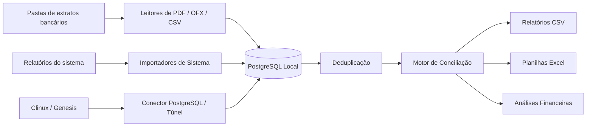
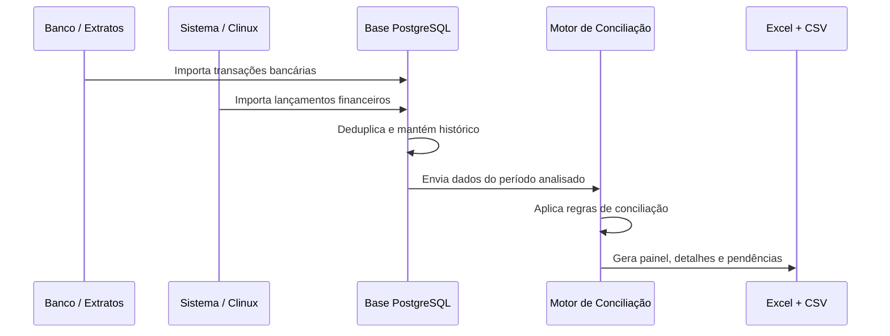

# BankSync — Conciliação Bancária Automatizada

<p align="center">
  <strong>Uma base permanente para importar extratos bancários, integrar dados do sistema, deduplicar lançamentos e gerar conciliações auditáveis.</strong>
</p>

<p align="center">
  
  
  
  
</p>

---

## Visão Geral

**BankSync** é um projeto de automação financeira criado para resolver um problema muito prático: parar de conciliar extratos e relatórios manualmente, arquivo por arquivo, mês por mês.

O sistema centraliza dados bancários e dados do sistema operacional/financeiro em uma base PostgreSQL local, aplica regras de conciliação, identifica inconsistências e gera relatórios em Excel/CSV para validação.

Ele foi pensado para cenários em que existem:

- extratos bancários em **PDF**, **OFX** ou **CSV**;
- relatórios financeiros exportados do sistema;
- dados vindos diretamente do **Clinux/Genesis**;
- múltiplas empresas, unidades, contas e bancos;
- lançamentos parcelados, duplicados, com datas divergentes ou descrições diferentes;
- necessidade de guardar histórico e consultar tudo depois sem voltar ao banco ou ao sistema.

---

## O Que O BankSync Faz

| Área | O que acontece |
|---|---|
| Importação bancária | Lê extratos PDF/OFX/CSV, extrai transações e grava na base histórica |
| Importação do sistema | Importa XLS/XLSX ou puxa dados do Clinux/Genesis quando disponível |
| Deduplicação | Evita duplicar lançamentos quando o mesmo movimento aparece em mais de um extrato |
| Conciliação | Cruza Banco x Sistema por valor, data, CNPJ/CPF, documento, fornecedor e texto aproximado |
| Parcelas | Encontra casos em que várias parcelas de um lado fecham o valor do outro |
| Tributos Caixa | Associa pagamentos à Caixa Econômica com impostos e encargos quando houver evidência |
| Retenção | Mantém apenas o período desejado, com backup antes de excluir dados antigos |
| Relatórios | Gera planilhas finais com painel, conciliados, pendências, duplicidades e divergências |

---

## Arquitetura



---

## Fluxo Principal



---

## Estrutura Do Projeto

```text
C:\ConciliaFinanceira
├── entrada\
│   ├── banco\                 # Arquivos bancários manuais
│   └── sistema\               # Arquivos exportados do sistema
├── processados\
│   ├── banco\                 # Cópias arquivadas dos bancos importados
│   └── sistema\               # Cópias arquivadas dos relatórios importados
├── dados\
│   ├── extracoes\             # CSVs extraídos dos PDFs e relatórios intermediários
│   └── backups\               # Backups antes de limpezas/exclusões
├── conciliados\               # Relatórios finais de conciliação
├── python\                    # Importadores, leitores, conciliação e auditorias
├── sql\                       # Schema e migrações da base histórica
├── config_pastas.example.json # Modelo de pastas monitoradas
├── atualizar_base.bat         # Atalho para atualização incremental
└── .env                       # Credenciais locais, não versionar
```

---

## Componentes Principais

### Base histórica

Arquivos:

- `python/base_historica.py`
- `python/aplicar_migracao_historico.py`
- `sql/schema.sql`
- `sql/historico_permanente.sql`

Responsável por:

- conectar ao PostgreSQL;
- registrar arquivos importados;
- guardar transações bancárias;
- guardar lançamentos do sistema;
- manter histórico de execuções de conciliação;
- permitir auditoria por arquivo, período, origem e conta.

### Leitores bancários

Arquivos:

- `python/leitores_pdf_banco.py`
- `python/extrair_banco_pdf_csv.py`
- `python/inventariar_pdfs_bancos_extratos.py`
- `python/extrair_transacoes_pdfs_inventario.py`
- `python/importar_transacoes_bancarias_deduplicadas.py`

Layouts já trabalhados no projeto:

- Cora
- Bradesco
- Banco do Brasil
- Caixa Econômica Federal
- Itaú
- Banco do Nordeste
- Unicred
- Uniprime
- Sicoob
- Safra
- Stone
- Banco da Amazônia/BASA

Alguns PDFs podem exigir OCR ou novos leitores específicos quando o banco muda o layout.

### Integração com o Sistema / Clinux

Arquivos:

- `python/importar_clinux_sistema.py`
- `python/testar_conexao_sistema_db.py`
- `python/testar_tunel_proprio_clinux.py`
- `python/clinux_tunel.py`
- `README_INTEGRACAO_SISTEMA.md`
- `README_TUNEL_CLINUX.md`

O BankSync pode trabalhar de duas formas:

- importando relatórios exportados do sistema;
- conectando diretamente ao banco do Clinux/Genesis quando houver credencial e túnel disponíveis.

Origens gravadas na base:

| Origem | Significado |
|---|---|
| `CLINUX` | Lançamentos financeiros reais do sistema |
| `CLINUX_TRANSFERENCIA` | Transferências entre contas |
| `ERP` | Importações antigas ou manuais |

Importante: transferências devem ser mantidas para conciliação bancária, mas não devem ser misturadas com faturamento bruto.

### Motor de Conciliação

Arquivos:

- `python/conciliar_cora.py`
- `python/conciliar_periodo.py`
- `python/conciliar_geral_2024_2026.py`
- `python/conciliar_ultimos_12_meses.py`
- `python/gerar_possiveis_divergencias_valor.py`
- `python/criar_excel_conciliacao_geral_streaming.py`

O motor aplica regras em camadas:

1. mesmo tipo de movimento;
2. mesmo valor;
3. mesmo documento/CNPJ/CPF;
4. mesma data ou data próxima;
5. fornecedor/prestador compatível;
6. descrição aproximada;
7. categorias textuais relacionadas;
8. agrupamento por soma de parcelas;
9. regras especiais para tributos pagos via Caixa Econômica;
10. validação de possíveis duplicidades.

---

## Regras De Conciliação

### Conciliado

Usado quando há evidência forte de que Banco e Sistema representam a mesma operação.

Exemplos:

- mesmo CNPJ, valor e data;
- mesmo CNPJ, valor e data próxima;
- mesmo valor, fornecedor compatível e data próxima;
- soma exata de parcelas com documento ou fornecedor compatível.

### Valor Igual Validar

Usado quando o valor bate, mas outras informações precisam ser revisadas.

Exemplos:

- data diferente;
- documento ausente;
- CNPJ diferente;
- fornecedor diferente;
- descrição sem ligação textual clara;
- mesmo valor em lançamentos muito parecidos.

Essa categoria é proposital: o BankSync concilia automaticamente, mas deixa sinalizado para validação humana.

### Banco Sem Sistema

Transação encontrada no banco, mas sem correspondência suficiente no sistema.

Pode indicar:

- lançamento não registrado no sistema;
- lançamento registrado com valor diferente;
- documento ausente;
- banco com descrição genérica;
- transferência não classificada;
- PDF importado corretamente, mas sistema incompleto.

### Sistema Sem Banco

Lançamento existente no sistema, mas sem transação bancária correspondente.

Pode indicar:

- lançamento provisionado, mas não realizado;
- baixa em outra conta;
- baixa em data diferente;
- lançamento duplicado no sistema;
- relatório do sistema mais detalhado que o extrato bancário.

### Possíveis Divergências

Quando há indício de relação, mas o valor não fecha.

Critérios atuais:

- mesmo documento ou raiz de CNPJ;
- mesmo tipo de movimento;
- data próxima ou mesmo mês;
- valor diferente.

### Duplicidades

Sinaliza grupos aparentemente repetidos.

Critérios atuais:

- mesma origem;
- mesmo mês;
- mesmo tipo;
- mesmo valor;
- mesmo documento ou texto-base parecido.

---

## Comandos Mais Usados

### Instalar dependências

```powershell
python -m venv .venv
.\.venv\Scripts\python.exe -m pip install -r requirements.txt
```

Depois, crie seu `.env` a partir do modelo:

```powershell
copy .env.example .env
```

E crie sua configuração local de pastas monitoradas:

```powershell
copy config_pastas.example.json config_pastas.json
```

Edite `config_pastas.json` com o caminho real da pasta de extratos. Esse arquivo é local e não deve ir para o GitHub.

### Aplicar estrutura inicial do banco

```powershell
C:\ConciliaFinanceira\.venv\Scripts\python.exe C:\ConciliaFinanceira\python\aplicar_migracao_historico.py
```

### Atualizar a base automaticamente

```powershell
C:\ConciliaFinanceira\.venv\Scripts\python.exe C:\ConciliaFinanceira\python\atualizar_base.py
```

Ou pelo atalho:

```powershell
C:\ConciliaFinanceira\atualizar_base.bat
```

### Atualizar apenas arquivos, sem Clinux

```powershell
C:\ConciliaFinanceira\.venv\Scripts\python.exe C:\ConciliaFinanceira\python\atualizar_base.py --sem-clinux
```

### Atualizar apenas Clinux

```powershell
C:\ConciliaFinanceira\.venv\Scripts\python.exe C:\ConciliaFinanceira\python\atualizar_base.py --somente-clinux
```

### Importar arquivo específico

```powershell
C:\ConciliaFinanceira\.venv\Scripts\python.exe C:\ConciliaFinanceira\python\importar_historico.py --banco C:\CAMINHO\BANCO.pdf --sistema C:\CAMINHO\SISTEMA.xls
```

### Inventariar PDFs bancários

```powershell
C:\ConciliaFinanceira\.venv\Scripts\python.exe C:\ConciliaFinanceira\python\inventariar_pdfs_bancos_extratos.py
```

### Importar transações bancárias deduplicadas

```powershell
C:\ConciliaFinanceira\.venv\Scripts\python.exe C:\ConciliaFinanceira\python\importar_transacoes_bancarias_deduplicadas.py
```

### Manter apenas os últimos 12 meses

```powershell
C:\ConciliaFinanceira\.venv\Scripts\python.exe C:\ConciliaFinanceira\python\manter_ultimos_12_meses.py --executar
```

Esse comando gera backup antes da exclusão.

### Gerar conciliação dos últimos 12 meses

```powershell
C:\ConciliaFinanceira\.venv\Scripts\python.exe -u C:\ConciliaFinanceira\python\conciliar_ultimos_12_meses.py
```

### Gerar planilha Excel final

```powershell
C:\ConciliaFinanceira\.venv\Scripts\python.exe C:\ConciliaFinanceira\python\criar_excel_conciliacao_geral_streaming.py
```

---

## Relatórios Gerados

Os relatórios ficam em:

```text
C:\ConciliaFinanceira\conciliados
```

Exemplo atual:

```text
C:\ConciliaFinanceira\conciliados\ultimos_12_meses
```

Arquivos principais:

| Arquivo | Conteúdo |
|---|---|
| `relatorio_conciliacao_ultimos_12_meses.xlsx` | Planilha final para análise |
| `01_resumo.csv` | Indicadores gerais |
| `02_conciliados.csv` | Todos os matches encontrados |
| `03_valor_igual_validar.csv` | Matches por valor igual com validação necessária |
| `04_divergencias.csv` | Divergências formais |
| `05_banco_sem_sistema.csv` | Transações bancárias sem correspondência |
| `06_sistema_sem_banco.csv` | Lançamentos do sistema sem banco |
| `07_duplicidades.csv` | Possíveis duplicidades |
| `08_possiveis_divergencias_valor.csv` | Indícios de relação com diferença de valor |

---

## Estado Validado

O projeto foi validado com uma base local real, mas os números de produção não ficam versionados no GitHub.

Os relatórios operacionais devem ser gerados localmente em:

```text
C:\ConciliaFinanceira\conciliados
```

---

## Segurança E Privacidade

Este projeto manipula informações financeiras sensíveis.

Nunca versionar:

- `.env`
- `config_pastas.json` com caminhos internos reais;
- `.venv`
- extratos bancários reais;
- backups;
- CSVs extraídos com dados financeiros;
- planilhas finais com dados reais;
- credenciais do Clinux/Genesis;
- chaves SSH;
- arquivos de configuração com senhas.

O `.gitignore` deve proteger, no mínimo:

```gitignore
.venv/
.env
__pycache__/
dados/
processados/
conciliados/
erros/
segredos/
```

---

## Configuração De Ambiente

Arquivo local:

```text
C:\ConciliaFinanceira\.env
```

Use `.env.example` como modelo. O arquivo `.env` real deve ficar apenas na máquina local.

Variáveis comuns:

```text
DB_HOST=
DB_PORT=
DB_NAME=
DB_USER=
DB_PASSWORD=
```

Para integração direta com o Clinux/Genesis:

```text
CLINUX_DB_HOST=
CLINUX_DB_PORT=
CLINUX_DB_NAME=
CLINUX_DB_USER=
CLINUX_DB_PASSWORD=
```

Para túnel SSH:

```text
CLINUX_SSH_HOST=
CLINUX_SSH_PORT=
CLINUX_SSH_USER=
CLINUX_SSH_PASSWORD=
```

Ou com chave:

```text
CLINUX_SSH_KEY_PATH=C:\ConciliaFinanceira\segredos\clinux_tunel
```

---

## Roadmap

| Prioridade | Item |
|---|---|
| Alta | Separar claramente comandos de produção e comandos de auditoria |
| Alta | Criar CLI única `banksync` para atualizar, conciliar e gerar relatório |
| Média | Melhorar OCR para PDFs escaneados |
| Média | Criar novos leitores para layouts bancários ainda não suportados |
| Média | Gerar dashboard web local para consulta rápida |
| Média | Criar agendamento diário de atualização |
| Baixa | Exportar métricas por unidade, banco, conta e centro de custo |
| Baixa | Criar testes automatizados para cada layout de PDF |

---

## Documentação Complementar

| Arquivo | Assunto |
|---|---|
| `README_BASE_HISTORICA.md` | Base permanente, pastas, atualização e leitores |
| `README_INTEGRACAO_SISTEMA.md` | Como pedir acesso ao banco do sistema |
| `README_TUNEL_CLINUX.md` | Túnel próprio para Clinux/Genesis |

---

## Nome Do Projeto

**BankSync — Conciliação Bancária Automatizada**

Um nome simples para uma missão bem objetiva: sincronizar Banco e Sistema, reduzir trabalho manual e transformar conciliação financeira em uma rotina confiável, auditável e repetível.
